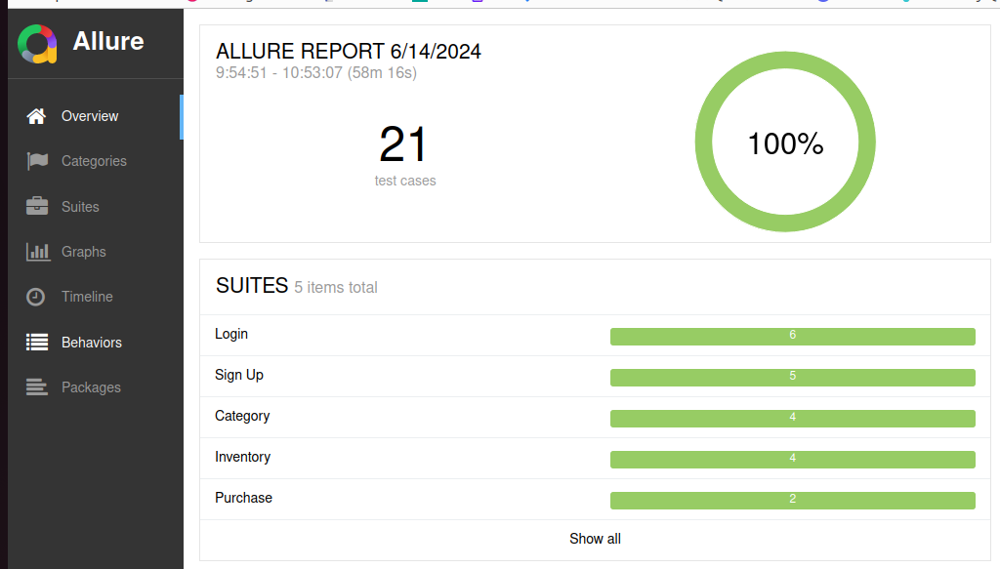
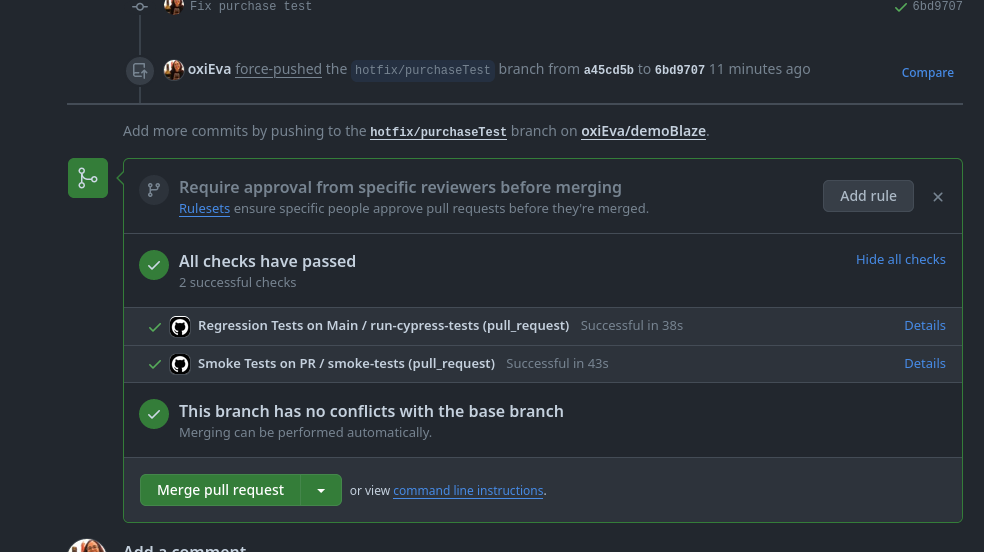
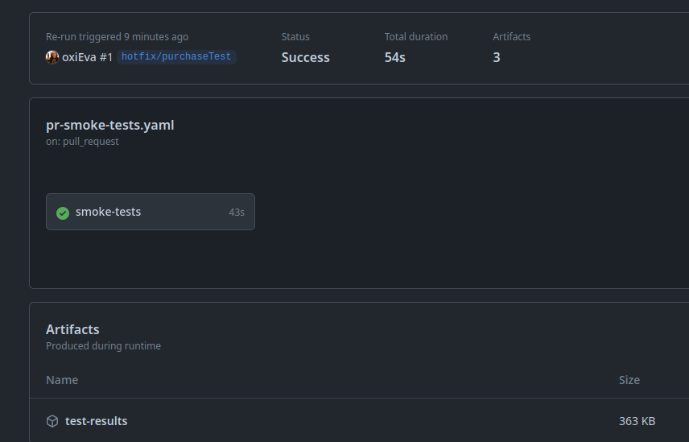

About this repository
==================
This repository contains the final exercise for the course QA & Testing from Hiberus University.

🌳 Cypress
---

This project uses [Cypress](https://www.cypress.io/) for end-to-end testing. We implement [Cucumber](https://cucumber.io/) 🥒.  We are working with [Blaze demo](https://demoblaze.com/). 

## Getting Started

To get started with this project, clone the repository and install the dependencies:

```sh
git clone https://github.com/yourusername/your-repo.git
cd your-repo
npm install
npx cypress open
```

✅ How I run the tests?
---

All tests: 
```sh
npx cypress run
```

Smoke: 
```sh
npm run e2e:smoke
```

Regression: 
```sh
npm run e2e:regression
```

📄 Reporting
---


If we want an Allure report, we can throw the command 

```sh
npx allure serve allure-results/
```
and we'll get this report:



➡️  Github actions
---

We are playing with some githubs actions
- Smoke Tests on PR 
- Regression Tests on Main 
- On-Demand Regression Tests

and see the reports in the artifacts

